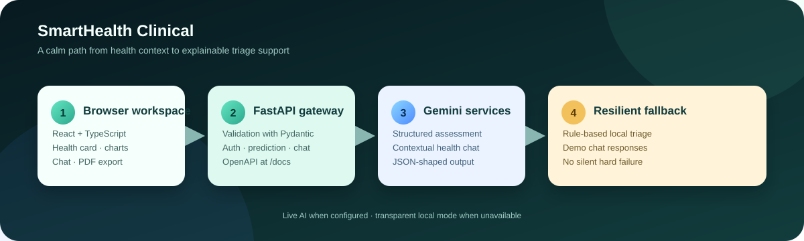
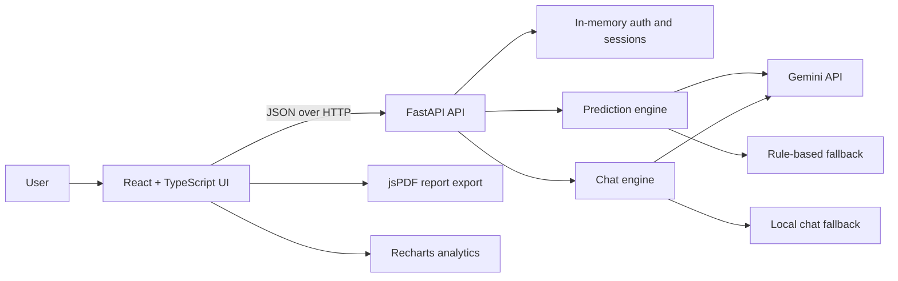
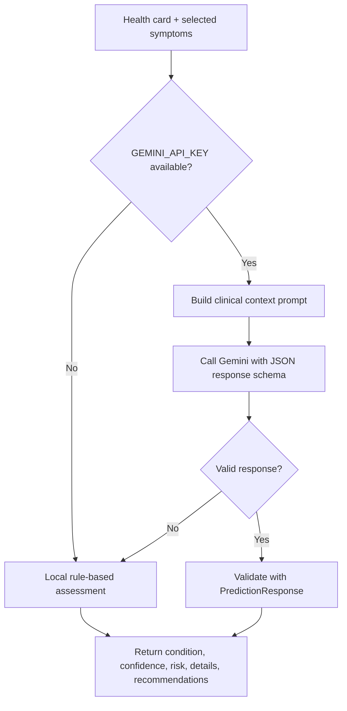
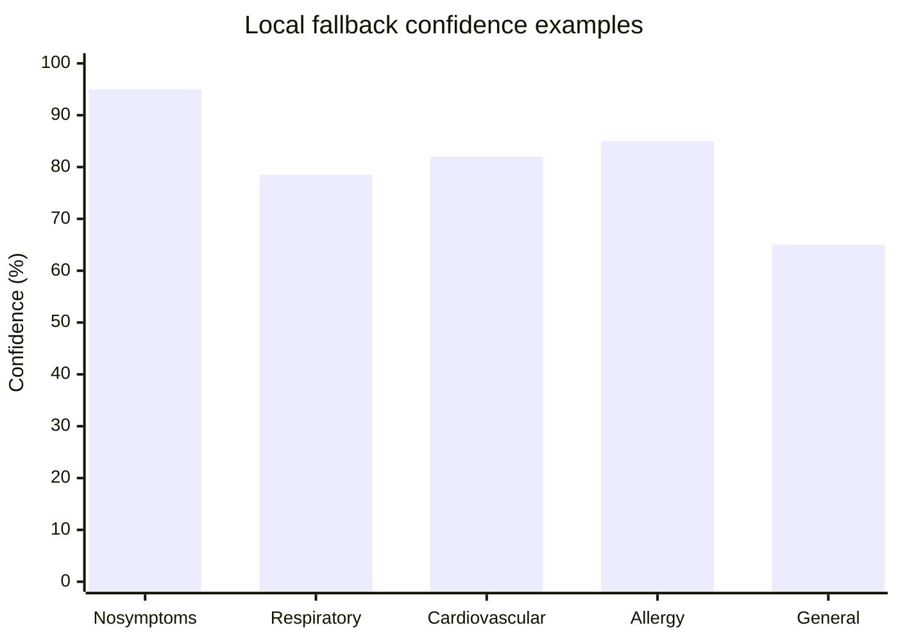

# SmartHealth Clinical

<p align="center">
  
</p>

<p align="center">
  <strong>A focused health passport, symptom triage, and clinical insight workspace.</strong><br />
  React + TypeScript on the front end. FastAPI + Gemini on the back end. Deterministic local fallbacks when AI is unavailable.
</p>

<p align="center">
  <a href="#quick-start">Quick start</a> ·
  <a href="#how-it-works">How it works</a> ·
  <a href="#api-reference">API reference</a> ·
  <a href="#safety-and-limitations">Safety</a>
</p>

<p align="center">
  
  
  
  
</p>

> **Important:** SmartHealth Clinical is an educational and prototype application. It does not provide a medical diagnosis, replace a licensed professional, or guarantee the accuracy of generated recommendations. Seek qualified medical care for real symptoms, especially emergencies.

## Why this project exists

Health information is often scattered across forms, notes, and disconnected measurements. SmartHealth Clinical brings a small but useful workflow into one place:

- build an interactive digital health card;
- record symptoms and current vitals;
- receive a structured risk assessment;
- ask contextual health questions in the chat workspace;
- inspect trend-oriented vital charts; and
- export the current assessment as a PDF report.

The application is designed to remain usable during development: if Gemini is unavailable, the backend falls back to transparent rule-based demo logic instead of failing silently.

## What is included

| Area | Capability | Implementation |
| --- | --- | --- |
| Health passport | Health ID, demographics, allergies, medications, conditions, vitals | React state + `HealthCard` |
| Symptom triage | Categorized symptom selection and search | React + Tailwind CSS |
| AI assessment | Structured condition, confidence, risk, details, recommendations | FastAPI + Gemini |
| Demo fallback | Local assessment when key, network, or AI response is unavailable | Rule-based Python predictor |
| Health chat | Context-aware questions about the current profile and prediction | Gemini chatbot + local fallback |
| Analytics | Heart rate, blood pressure, and SpO2 visualizations | Recharts |
| Identity | Registration, login, guest access, bearer sessions | FastAPI in-memory store |
| Reporting | Downloadable PDF assessment | jsPDF |
| Experience | Theme switching, animated landing experience, responsive workspace | React, Tailwind, Lucide, custom components |

## Quick start

### Prerequisites

- Python 3.10+ recommended
- Node.js 18+ and npm
- A Gemini API key for live AI responses (optional; demo mode works without it)

### 1. Configure the backend

From the repository root, create `backend/.env`:

```env
GEMINI_API_KEY=your_gemini_api_key
HOST=127.0.0.1
PORT=8000
```

`backend/.env` is ignored by Git. Never commit a real API key. If a key has been exposed, revoke it and create a replacement in Google AI Studio.

Create or activate the Python environment and install dependencies:

```powershell
cd backend
python -m venv .venv
.\.venv\Scripts\Activate.ps1
pip install -r requirements.txt
```

PowerShell may require this one-session policy adjustment:

```powershell
Set-ExecutionPolicy -Scope Process -ExecutionPolicy RemoteSigned
```

Start the API:

```powershell
python -m uvicorn main:app --reload --host 127.0.0.1 --port 8000
```

The API is available at <http://127.0.0.1:8000>. Interactive OpenAPI docs are at <http://127.0.0.1:8000/docs>.

### 2. Start the frontend

Open a second terminal:

```powershell
cd frontend
npm install
npm run dev
```

Open the Vite URL shown in the terminal, normally <http://localhost:5173>.

The prediction request uses `VITE_API_URL` when it is set and otherwise defaults to `http://127.0.0.1:8000`:

```env
# frontend/.env.local
VITE_API_URL=http://127.0.0.1:8000
```

> Some authentication and chat components currently use the local backend URL directly. For a non-local deployment, update those components or place the API behind the same origin before deploying.

## How it works

### System architecture

The repository is intentionally split into a browser client and a small API service. The browser owns the interactive health workspace; the API owns validation, AI calls, fallback logic, and session operations.



### Prediction request flow



### Risk analysis chart

The local fallback is deliberately simple and inspectable. It prioritizes potentially urgent signals before general fatigue-like symptoms.



| Priority | Trigger in local fallback | Default risk | Example response |
| ---: | --- | --- | --- |
| 1 | Chest pain, dyspnea, systolic BP ≥ 160, or heart rate ≥ 110 | High | Cardiovascular risk warning |
| 2 | Fever plus cough or sore throat | Medium / High | Viral respiratory infection |
| 3 | Rash, itching, or allergic reaction | Medium / High | Acute allergic reaction |
| 4 | No critical match | Low | Acute fatigue and systemic malaise |

These are prototype heuristics, not validated clinical rules. The Gemini path can produce a different result and should still be reviewed by a qualified professional.

## API reference

The FastAPI service exposes the following endpoints:

| Method | Endpoint | Purpose | Auth |
| --- | --- | --- | --- |
| `GET` | `/` | Service status and Gemini availability flag | No |
| `POST` | `/api/auth/register` | Create an account and return a bearer token | No |
| `POST` | `/api/auth/login` | Authenticate an existing account | No |
| `POST` | `/api/auth/guest` | Create a temporary guest session | No |
| `GET` | `/api/auth/me` | Resolve the current bearer token | Bearer token |
| `POST` | `/api/predict-disease` | Generate a structured health risk assessment | No |
| `POST` | `/api/chat` | Ask a contextual health question | No |

### Prediction payload

```json
{
  "health_card": {
    "health_id": "SH-29381-XYZ",
    "age": 28,
    "gender": "Male",
    "blood_group": "O+",
    "chronic_conditions": ["Seasonal Allergies"],
    "allergies": ["Penicillin"],
    "current_medications": [],
    "vitals": {
      "heart_rate": 72,
      "bp_systolic": 120,
      "bp_diastolic": 80,
      "spo2": 98
    }
  },
  "symptoms": ["Fatigue", "Headache"]
}
```

### Prediction response shape

```json
{
  "condition": "Acute Fatigue & Systemic Malaise",
  "confidence": 65.0,
  "risk_level": "Low",
  "details": "Clinical reasoning and limitations...",
  "recommendations": ["Monitor symptoms", "Stay hydrated"]
}
```

For the complete request and response schemas, use FastAPI's generated docs at `/docs` while the backend is running.

## Project layout

```text
HealthCare/
├── backend/
│   ├── main.py          # FastAPI application and routes
│   ├── predictor.py     # Gemini predictor and local fallback rules
│   ├── chatbot.py       # Contextual Gemini chat and local fallback
│   ├── auth.py          # Password hashing and in-memory sessions
│   ├── requirements.txt
│   └── .env             # Local secrets; ignored by Git
├── frontend/
│   ├── src/
│   │   ├── App.tsx
│   │   ├── components/  # Health card, chat, analytics, auth, landing UI
│   │   └── context/     # Theme state
│   ├── package.json
│   └── vite.config.ts
├── docs/
│   └── architecture.svg
├── .gitignore
└── README.md
```

## Development commands

Run these from `frontend/`:

| Command | Result |
| --- | --- |
| `npm run dev` | Start Vite development server |
| `npm run build` | Type-check and create a production build |
| `npm run lint` | Run Oxlint |
| `npm run preview` | Preview the production build |

Run these from the repository root:

```powershell
# Backend syntax check
.\backend\.venv\Scripts\python.exe -m compileall -q backend

# Frontend checks
Push-Location frontend
npm run lint
npm run build
Pop-Location
```

## Security and data boundaries

This project is a prototype, so understand the current boundaries before using it with real data:

- API keys belong only in ignored environment files or deployment secret stores.
- Authentication data and bearer sessions are stored in memory and disappear when the backend restarts.
- There is no production database, account recovery, email verification, rate limiting, or audit log.
- CORS is currently permissive for local integration and must be restricted before production deployment.
- The app sends health-card context to Gemini when live AI mode is enabled. Do not submit identifiable patient information to a development deployment.
- AI output is probabilistic and must not be treated as a diagnosis or emergency triage decision.
- The PDF export is a user convenience, not a signed medical record.

## Troubleshooting

### The UI says it is using demo mode

Confirm that:

1. `backend/.env` exists;
2. it contains a valid `GEMINI_API_KEY`;
3. the backend was restarted after changing the file; and
4. the backend terminal can reach the Gemini service.

The app intentionally continues with local rules when the key is missing, invalid, or the AI request fails.

### `name 'genai' is not defined`

This repository imports the Gemini SDK in `backend/predictor.py` and `backend/chatbot.py`. Pull the latest `main` branch, reinstall backend dependencies if necessary, and restart Uvicorn:

```powershell
git pull origin main
cd backend
.\.venv\Scripts\Activate.ps1
pip install -r requirements.txt
python -m uvicorn main:app --reload --port 8000
```

### The frontend cannot reach the API

Make sure the backend is running on port `8000`, then set `VITE_API_URL` in `frontend/.env.local` and restart Vite. Browser network errors can also come from using a different host, port, or protocol than the backend CORS configuration expects.

## Roadmap

- Replace in-memory users and sessions with a persistent database.
- Move all frontend API calls behind one configurable client.
- Add automated backend tests for schemas, auth, fallback rules, and API routes.
- Add request validation, rate limiting, audit logging, and production CORS policy.
- Migrate from the deprecated `google.generativeai` package to Google's current GenAI SDK.
- Add observability for model latency, fallback frequency, and failed requests.

## Contributing

1. Create a focused branch.
2. Keep secrets out of commits.
3. Run the frontend lint/build checks and backend compile check.
4. Explain behavior changes and fallback behavior in the pull request.

## License

This project is licensed under the MIT License - see the LICENSE file for details.

---

<p align="center">
  Built as a practical prototype for safer, clearer health-information workflows.
</p>
